# puntero34

a low profile pointer peripheral with 17 switches.

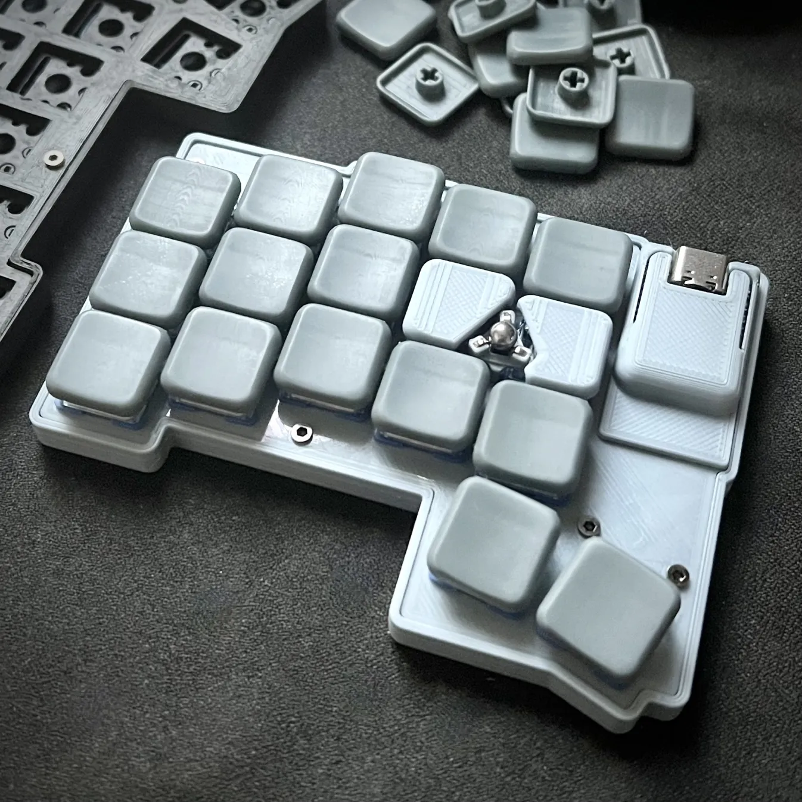

### design principles
- compatible for seeed xiao ble, or pro micro form factor mcu board
- integrated [pat9125el-pcb](https://github.com/badjeff/pat9125el-pcb)
- tiny stainless steel trackball on disc magnets mount
- 3d printed go-first
- case with lot of straight edges

### gallery

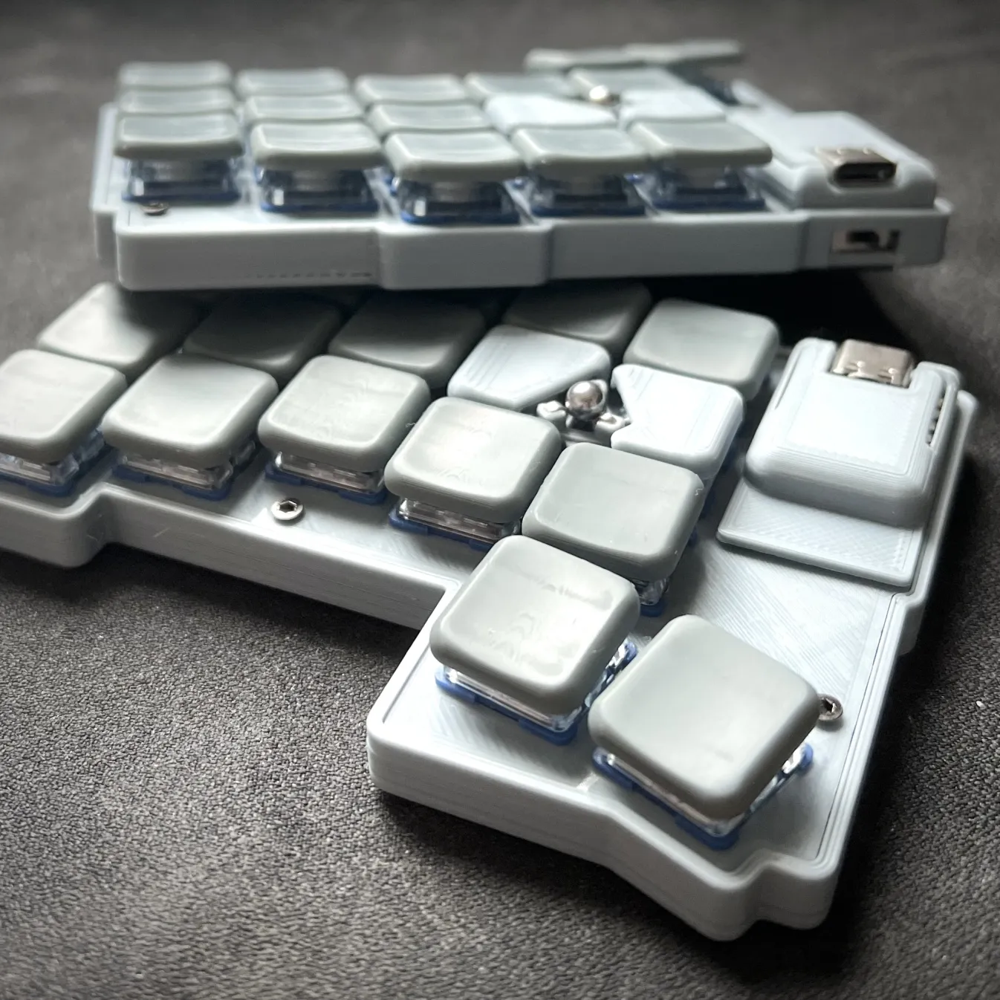
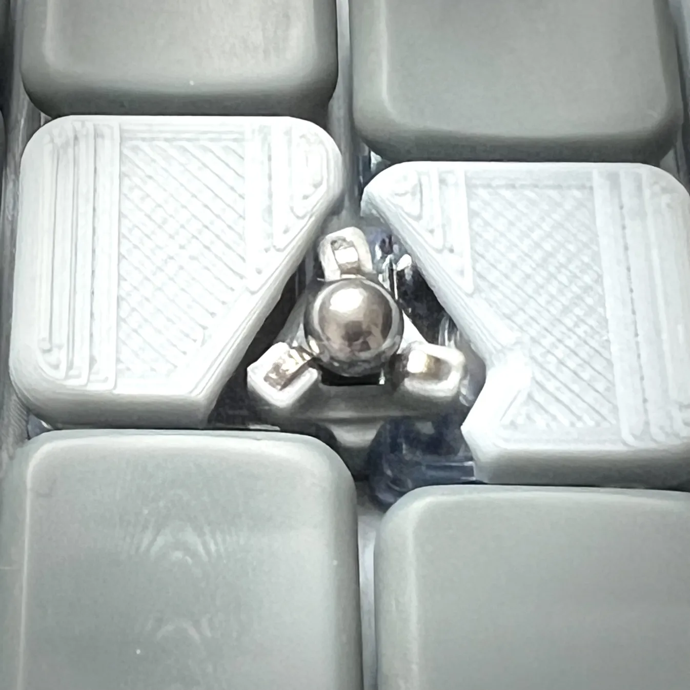
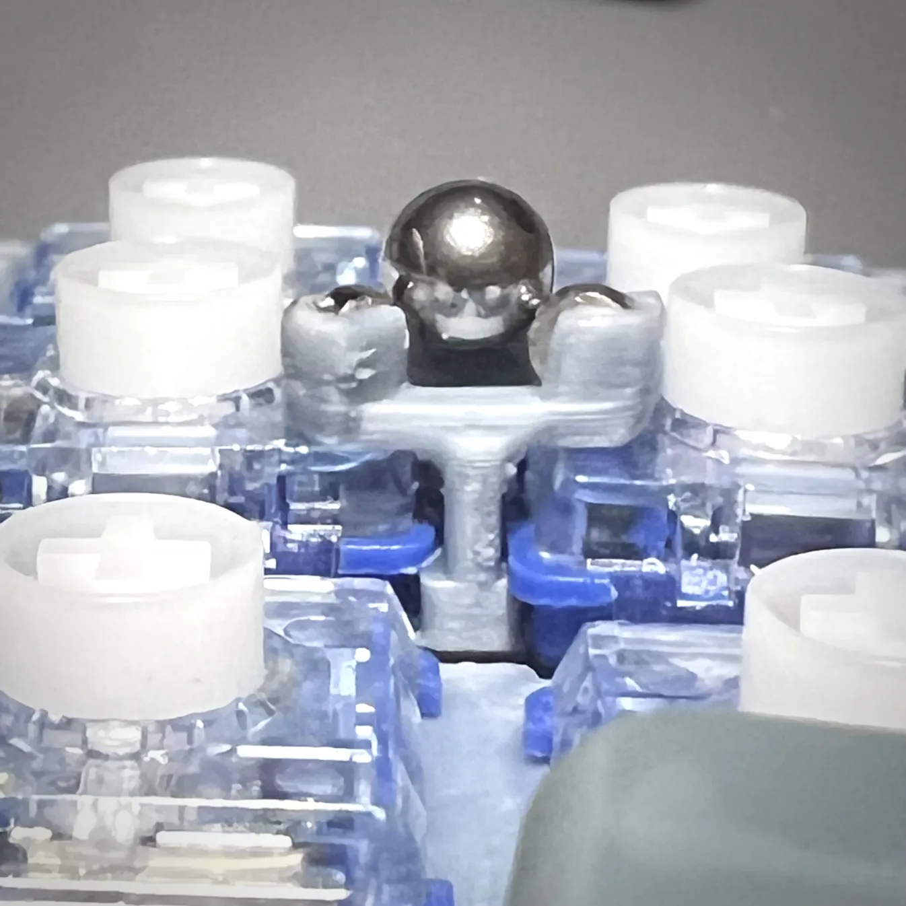
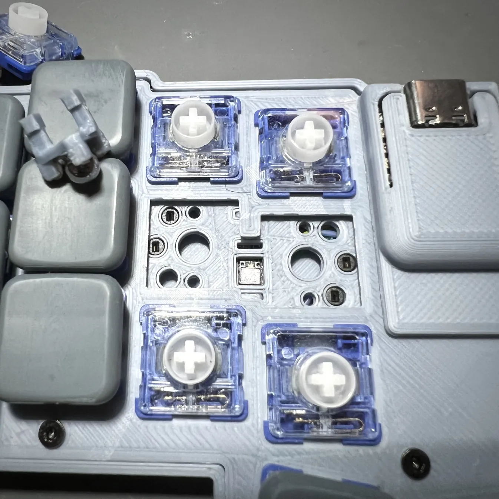
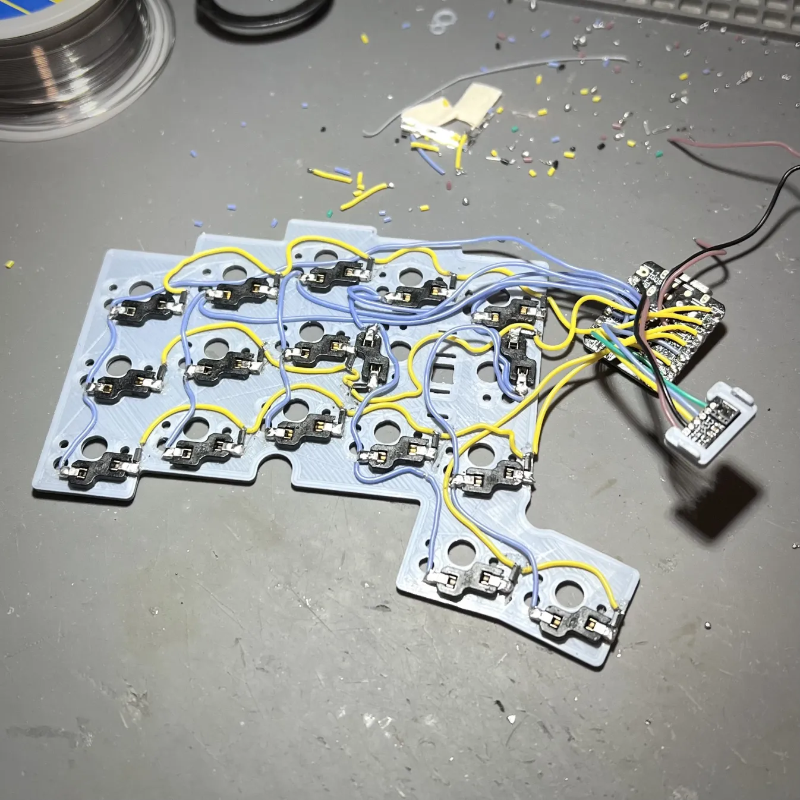

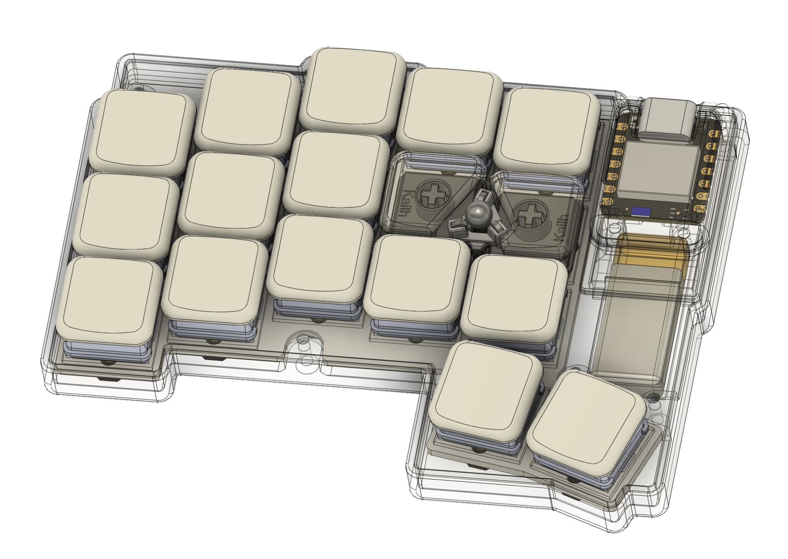
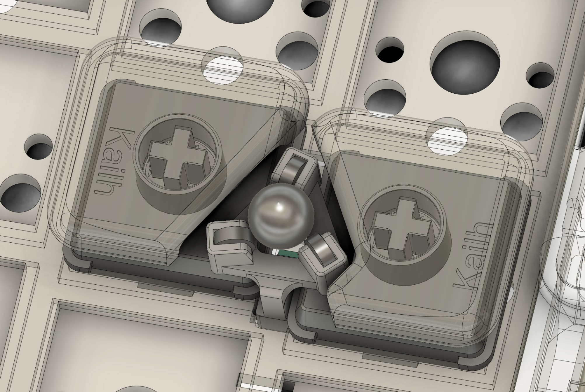
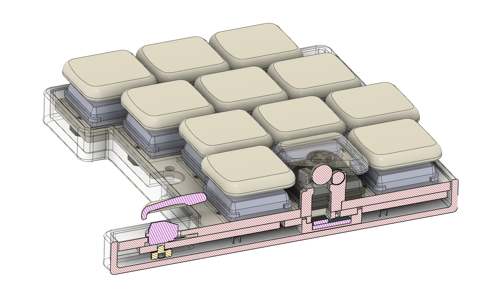
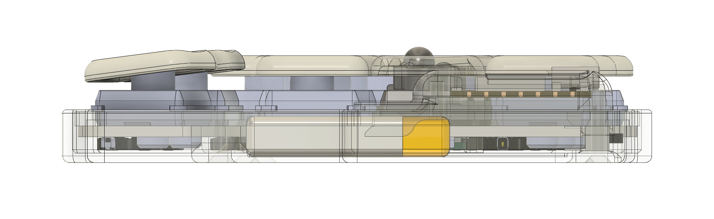
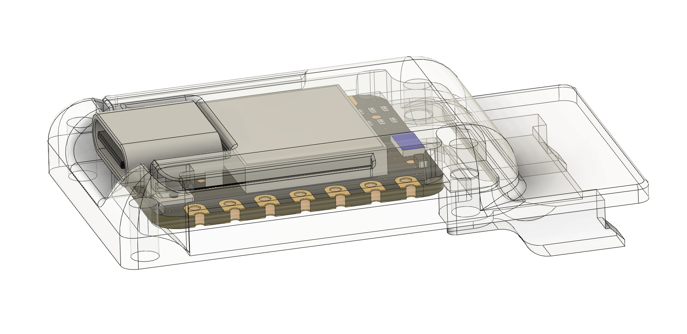
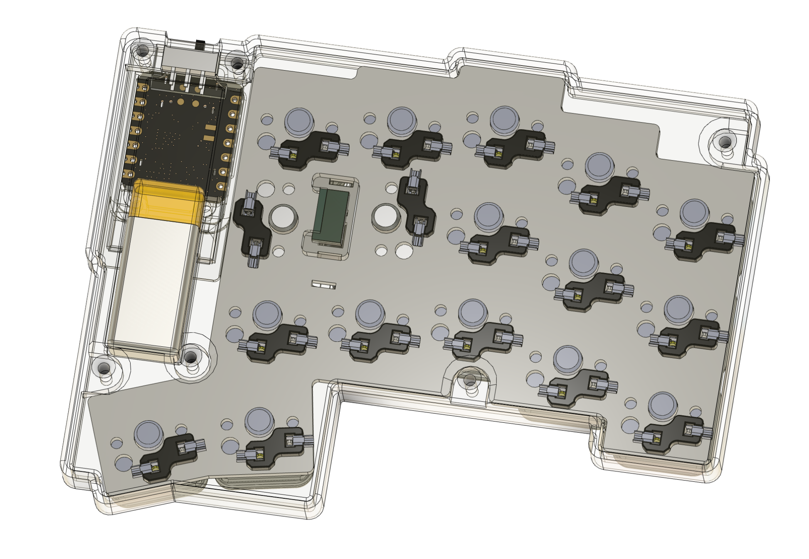

### bom
|unit|item|
|-|-|
|1|Seeed Studio XIAO BLE (nRF52840)|
|1|PAT9125EL-TKIT Sensor [Breakout Board](https://github.com/badjeff/pat9125el-pcb)|
|34|Kailh PG1353 Choc v2 Switch|
|34|Kailh PG1350 Choc Switch Socket|
|34|1N4148W T4 SOD-123 Diode|
|2|4.75mm Steel Ball|
|6|Neodymium Disc Magnets 3x1mm (Diameter x Thick)|
|1|MSK-1153 6 Pins Power Switch|
|12|M2x5 Screw|
|4|M2x9 Screw|
|1|601230 Lipo Battery (plus connector)|
|1|30/28/26 AWG silicone wire|
|8|Anti slip silicone rubber adhesive pads|

### building guide / tips

- NOT for beginner. Requiring experience of building at least one wireless keyboard on [ZMK](https://github.com/zmkfirmware/zmk).
- ONLY left side STL files available, mirror in slicer of your choice for the right side, except `pat9125 bucket.stl`, it used to be rotate 180 on right side.
- PRINT trackball mount with 0.2 nozzle.
- WIRE key scan matrix gpios following `puntero34.dtsi` file in firmware config on below.

### firmware

the ZMK firmware config repository can be find at [here](https://github.com/badjeff/zmk-config/tree/core/move-to-zephyr-4-1/config/boards/shields/puntero34).

## license

available under the [CERN-OHL-P v2](/LICENSE) permissive license.
